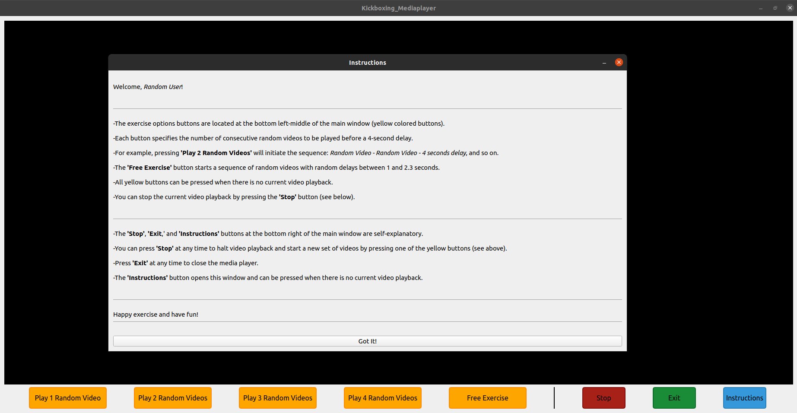

KickBoxing_Mediaplayer
======================
A media player based on Qt5.

About This Project
==================
This project was inspired by a basic kickboxing exercise: the "*attacker - defender*". The purpose of this exercise it to learn to react to specific hits, solely by observing the *attack* move, because as a starter in kickboxing, no connected hits are allowed.<br>
In this exercise, the *attacker* launches an attack, and the *defender* must use the correct defense for that move. However, what happens when you're at home alone without a partner to act as the *attacker,* making it challenging to practice your reflexes by reacting to *attacks*?<br>
This is where this project can be useful. You can simply record each move in a video and use this player to play them in random order, allowing you to exercise your reflexes.

The media player offers 5 exercise options:
1. Play 1 Random Videos: By choosing this option the media player starts the sequence: *Random Video - 4 sec delay - Random Video* and so on.
2. Play 2 Random Videos: By choosing this option the media player starts the sequence: *Random Video - Random Video - 4 sec delay - Random Video - Random Video - 4 sec delay* and so on.
3. Play 3 Random Videos: By choosing this option the media player starts the sequence: *Random Video - Random Video - Random Video - 4 sec delay - Random Video - Random Video - Random Video - 4 sec delay* and so on.
4. Play 4 Random Videos: By choosing this option the media player starts the sequence: *Random Video - Random Video - Random Video - Random Video - 4 sec delay - Random Video - Random Video - Random Video - Random Video - 4 sec delay* and so on.
5. Free Exercise Option: By choosing this option the media player starts the sequence: *Random Video - Random delay between 1 and 2.3 sec - Random Video - Random delay between 1 and 2.3 sec* and so on.

The user may choose to stop the video playback at any time and exit/start another video sequence/see the instructions.

How To Use the Media Player?
============================
1. Record each *attack* move in an .*mp4* video.
2. Place the videos in a folder.
3. Update the constructor in *MainWindow.cc* with the videos folder path.
4. Assuming you are in the folder where you have cloned this project, open a terminal. For example, on *Ubuntu 20.04*:
   
``` sh
qmake
make
./Kickboxing_Mediaplayer
```
5. Follow the instructions in the pop-up window.

Screenshots
===========
<div align="center">
    
</div>

Dependencies
============
- *Qt5 framework*. You must have it installed on you system. For example, on *Ubuntu 20.04*:

``` sh
sudo apt install qt5-default
```
